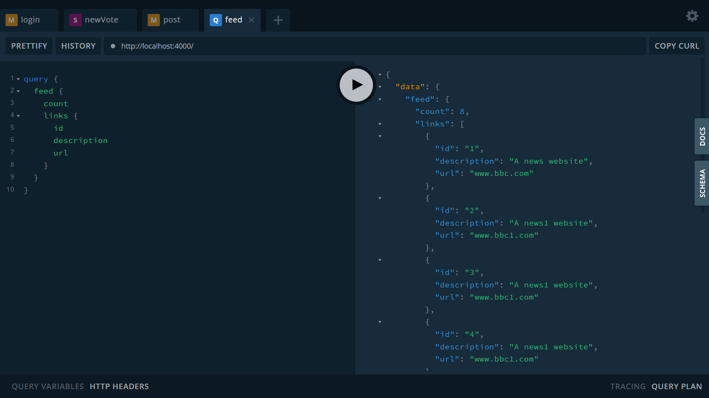

# :zap: GraphQL Node Data

* Node app to display data from a PostgreSQL database using Apollo-Server & GraphQL.
* **Note:** to open web links in a new window use: _ctrl+click on link_


## :page_facing_up: Table of contents

* [:zap: GraphQL Node Data](#zap-graphql-node-data)
  * [:page_facing_up: Table of contents](#page_facing_up-table-of-contents)
  * [:books: General info](#books-general-info)
  * [:camera: Screenshots](#camera-screenshots)
  * [:signal_strength: Technologies](#signal_strength-technologies)
  * [:floppy_disk: Setup](#floppy_disk-setup)
  * [:wrench: Testing](#wrench-testing)
  * [:computer: Code Examples](#computer-code-examples)
  * [:cool: Features](#cool-features)
  * [:clipboard: Status, Testing & To-Do List](#clipboard-status-testing--to-do-list)
  * [:clap: Inspiration/General Tools](#clap-inspirationgeneral-tools)
  * [:file_folder: License](#file_folder-license)
  * [:envelope: Contact](#envelope-contact)

## :books: General info

* PostgreSQL used as the database with Prisma to access it. PostgreSQL installed on Windows 10 Home. It was not possible to use MongoDB Atlas.
* Prisma Client used: auto-generated & type-safe query builder. Prisma CRUD operations are asynchronous.

## :camera: Screenshots



## :signal_strength: Technologies

* [Node.js v16](https://nodejs.org/en/) JavaScript runtime built on Chrome's V8 JavaScript engine.
* [Apollo Server v2](https://github.com/apollographql/apollo-server) to connect a GraphQL schema to an HTTP server in Node. js.
* [GraphQL v2](https://graphql.org/) - latest is version 3 but that does not include the GraphQL playground by default
* [Prisma v3](https://www.prisma.io/) database toolkit for PostgreSQL
* [Prisma Studio v3](https://www.prisma.io/studio) database GUI. Only opens in inPrivate Chrome web browser
* [WebSocket](https://en.wikipedia.org/wiki/WebSocket) subscriptions for realtime notifications
* [Apollo external PubSub Engine](https://www.apollographql.com/docs/graphql-subscriptions/external-pubsub/) using the AsyncIterator interface
* [BCrypt.js v2](https://www.npmjs.com/package/bcryptjs) password-hashing function
* [jsonwebtoken v8](https://www.npmjs.com/package/jsonwebtoken): a compact, URL-safe means of representing claims to be transferred between two parties.

## :floppy_disk: Setup

* Install dependencies using `npm i`
* Add database URL to `.env` - see `example.env`. Database is specified in `schema.prisma`
* Run `node src/index.js` to start app
* After changes to prisma run `npx prisma migrate dev --name "very brief summary"`
* To apply the changes and update your Prisma Client API run `npx prisma generate`

## :wrench: Testing

* n/a

## :computer: Code Examples

* `/resolvers/Mutation.js` nested write function to write relational data to database

```javascript
async function post(parent, args, context, info) {
  const { userId } = context;

  return await context.prisma.link.create({
    data: {
      url: args.url,
      description: args.description,
      title: args.title,
      postedBy: {
        connect: {
          id: userId,
        },
      },
    },
  });
}
```

## :cool: Features

* GraphQL: provides a complete and understandable description of the API data. Clients can ask for exactly what they need and nothing more, saving cost on mobile data plans etc. Easier to evolve APIs over time. Enables powerful developer tools

## :clipboard: Status, Testing & To-Do List

* Status: Working
* To-Do: Nothing

## :clap: Inspiration/General Tools

* [howtographql.com tutorial](https://www.howtographql.com/graphql-js/4-adding-a-database/)

## :file_folder: License

* N/A

## :envelope: Contact

* Repo created by [ABateman](https://github.com/AndrewJBateman), email: gomezbateman@yahoo.com
